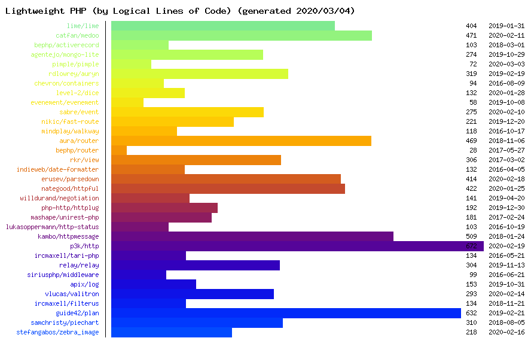

Lightweight PHP
===============

List of lightweight PHP libraries.

- [Lightweight PHP](#lightweight-php)
  - [Frameworks](#frameworks)
  - [Dependency Injection](#dependency-injection)
  - [Events](#events)
  - [Routing](#routing)
  - [HTTP](#http)
  - [Validation and Filtering](#validation-and-filtering)
  - [Graphics](#graphics)

## Frameworks

* [Shield](https://github.com/enygma/shieldframework) - A security minded microframework
* [Silica](https://github.com/changloong/Silica) - Micro framework inspired by Silex
* [Lime](https://github.com/aheinze/Lime) - Micro framework for quickly creating web applications with minimal effort
* [Bento](https://github.com/nramenta/bento) - Simple PHP micro framework
* [Maverick](https://github.com/gunnar94/Maverick) - A lightweight framework for PHP
* [Dispatch](https://github.com/badphp/dispatch) - Dispatch is a PHP 5.4+ micro-framework

## Dependency Injection

* [Pimple](https://github.com/fabpot/Pimple) - A small PHP 5.3 dependency injection container
* [Auryn](https://github.com/rdlowrey/Auryn) - IoC dependency injector
* [Orno\Di](https://github.com/orno/di) - A fast and powerful dependency injection container
* [Containers](https://github.com/chevronphp/containers) - An implementation of the registry pattern
* [Dice](https://github.com/TomBZombie/Dice) - A minimalist Dependency injection container (DIC) for PHP.
* [Suda](https://github.com/guide42/suda) - A lightweight container for your services

## Events

* [Événement](https://github.com/igorw/evenement) - Very simple event dispatching library
* [Sabre Event](https://github.com/fruux/sabre-event) - A library for lightweight event-based programming

## Routing

* [FastRoute](https://github.com/nikic/FastRoute) - Fast request router for PHP
* [Walkway](https://github.com/mindplay-dk/walkway) - Elegant, modular router for PHP.

## HTTP

* [Httpful](https://github.com/nategood/httpful) - A chainable, REST friendly, PHP HTTP client
* [Negotiation](https://github.com/willdurand/Negotiation) - Content negotiation tools for PHP

## Validation and Filtering

* [Valitron](https://github.com/vlucas/valitron) - A simple, elegant, stand-alone validation library
* [Filterus](https://github.com/ircmaxell/filterus) - A simple filtering library for PHP
* [Plan](https://github.com/guide42/plan) - Fast and simple validation for PHP

## Graphics

* [PieChart](https://github.com/SamChristy/PieChart) - A simple class for drawing pie charts
